```mermaid
graph TD
    RA["run_agent.py<br/>(AIAgent)"]
    PCP["prompt_builder.py<br/>_build_system_prompt()"]
    CCP["context_compressor.py<br/>ContextCompressor.compress()"]
    MTP["model_tools.py<br/>sanitize_api_messages()"]
    SST["hermes_state.py<br/>SessionDB"]
    SHE["hermes_cli/skin_engine.py<br/>init_skin_from_config()"]
    FOP["tools/file_operations.py<br/>ShellFileOperations"]
    FUZ["tools/fuzzy_match.py<br/>fuzzy_find_and_replace()"]
    PAT["tools/patch_parser.py<br/>parse_v4a_patch()"]
    HON["honcho_integration/session.py<br/>_honcho_http_rust"]
    TDP["run_agent.py<br/>_execute_tool_calls_concurrent_rs()"]
    CRE["agent/context_references.py<br/>parse_context_references()"]
    APP["tools/approval.py<br/>check_approval()"]

    PB_RS["prompt_builder_rs"]
    CO_RS["compressor_rs"]
    MT_RS["model_tools_rs"]
    HS_RS["hermes_state_rs"]
    SK_RS["skin_engine_rs"]
    FO_RS["file_ops_rs"]
    FM_RS["fuzzy_match_rs"]
    PP_RS["patch_parser_rs"]
    HH_RS["honcho_http_rs"]
    TD_RS["tool_dispatch_rs"]
    CR_RS["context_refs_rs"]
    AP_RS["approval_rs"]

    RA -->|"prompt assembly"| PCP
    RA -->|"tool registry"| MTP
    RA -->|"context compression"| CCP
    RA -->|"session / search"| SST
    RA -->|"skin loading"| SHE
    RA -->|"honcho session"| HON
    RA -->|"parallel tool batch"| TDP
    RA -->|"@ reference parsing"| CRE

    PCP -->|"wired ✓"| PB_RS
    PCP -.->|"fallback"| PCP

    CCP -->|"wired ✓"| CO_RS
    CCP -.->|"fallback"| CCP

    MTP -->|"wired ✓"| MT_RS
    MTP -.->|"fallback"| MTP

    SST -->|"wired ✓"| HS_RS
    SST -.->|"fallback"| SST

    SHE -->|"wired ✓"| SK_RS
    SHE -.->|"fallback"| SHE

    FOP -->|"wired ✓"| FO_RS
    FOP -.->|"fallback"| FOP

    FUZ -->|"wired ✓"| FM_RS
    FUZ -.->|"fallback"| FUZ

    PAT -->|"wired ✓"| PP_RS
    PAT -.->|"fallback"| PAT

    HON -->|"wired ✓"| HH_RS
    HON -.->|"fallback"| HON

    TDP -->|"wired ✓"| TD_RS
    TDP -.->|"fallback"| TDP

    CRE -->|"wired ✓"| CR_RS
    CRE -.->|"fallback"| CRE

    APP -->|"callable ✓"| AP_RS
    APP -.->|"fallback"| APP

    style PB_RS fill:#de5347,color:#fff
    style CO_RS fill:#de5347,color:#fff
    style MT_RS fill:#de5347,color:#fff
    style HS_RS fill:#de5347,color:#fff
    style SK_RS fill:#de5347,color:#fff
    style FO_RS fill:#de5347,color:#fff
    style FM_RS fill:#de5347,color:#fff
    style PP_RS fill:#de5347,color:#fff
    style HH_RS fill:#de5347,color:#fff
    style TD_RS fill:#de5347,color:#fff
    style CR_RS fill:#de5347,color:#fff
    style AP_RS fill:#de5347,color:#fff
```

# Hermes Agent - Ferris Fork ☤

A performance oriented Rust fork of [Hermes Agent](https://github.com/NousResearch/hermes-agent) by Nous Research. Maintained by [agent-bob-the-builder](https://github.com/agent-bob-the-builder) at [github.com/agent-bob-the-builder/hermes-agent-ferris-fork](https://github.com/agent-bob-the-builder/hermes-agent-ferris-fork).

---

## What & Why

16 PyO3 extension crates replace hot-path Python code — no visible behaviour change, but meaningfully faster on every agent turn. All wired crates use transparent Python fallbacks; if a crate is missing or fails to load, the Python implementation runs instead with no visible difference.

| Crate | Hot path | Status |
|---|---|---|
| `compressor_rs` | `ContextCompressor.compress()` | Wired ✓ |
| `model_tools_rs` | Tool registry + message sanitization | Wired ✓ |
| `prompt_builder_rs` | System prompt assembly | Wired ✓ |
| `skin_engine_rs` | Skin/theme loading and config | Wired ✓ |
| `hermes_state_rs` | SQLite SessionDB + FTS5 search | Wired ✓ |
| `file_ops_rs` | Binary detection, line numbering, path expansion, shell escaping, unified diff, fuzzy file search | Wired ✓ |
| `fuzzy_match_rs` | 8-strategy fuzzy find-and-replace | Wired ✓ |
| `patch_parser_rs` | V4A patch format parsing | Wired ✓ |
| `ansi_strip_rs` | Strip ANSI escape sequences | Wired ✓ |
| `redact_rs` | Sensitive data redaction | Wired ✓ |
| `subprocess_rs` | Subprocess orchestration | Wired ✓ |
| `run_agent_loop_rs` | Core agent loop | Wired ✓ |
| `tool_dispatch_rs` | Rayon-based parallel tool batch execution | Wired ✓ |
| `retry_state_machine_rs` | Retry/fallback/compression state machine | Callable ✓ |
| `honcho_http_rs` | Honcho HTTP client | Wired ✓ |
| `context_refs_rs` | @-reference parsing + token stripping | Wired ✓ |
| `approval_rs` | Dangerous command detection / approval | Callable ✓ |

Wired crates have **transparent Python fallbacks** — if a crate is missing or fails to load, the Python implementation runs instead with no visible difference.

**Wiring map:**

```
AIAgent (run_agent.py)
├── context_compressor.py
│   └── compressor_rs.compress_async()             [Wired ✓]
├── model_tools.py + tools/registry_rs.py
│   └── model_tools_rs.sanitize()                 [Wired ✓]
├── hermes_state.py
│   └── hermes_state_rs session ops               [Wired ✓]
├── hermes_cli/skin_engine.py
│   ├── skin_engine_rs init_skin_from_config()    [Wired ✓]
│   └── prompt_builder_rs _build_system_prompt()  [Wired ✓]
├── tools/
│   ├── file_operations.py (ShellFileOperations)
│   │   ├── _is_likely_binary() → file_ops_rs             [Wired ✓]
│   │   ├── _add_line_numbers() → file_ops_rs             [Wired ✓]
│   │   ├── _native_expand_path() → file_ops_rs           [Wired ✓]
│   │   ├── _escape_shell_arg() → file_ops_rs             [Wired ✓]
│   │   ├── _unified_diff() → file_ops_rs                 [Wired ✓]
│   │   ├── _suggest_similar_files() → file_ops_rs        [Wired ✓]
│   │   └── _search_native() → file_ops_rs                [Wired ✓]
│   ├── fuzzy_match.py
│   │   └── fuzzy_find_and_replace() → fuzzy_match_rs     [Wired ✓]
│   └── patch_parser.py
│       └── parse_v4a_patch() → patch_parser_rs           [Wired ✓]
├── run_agent.py
│   ├── _should_parallelize_tool_batch()
│   │   └── tool_dispatch_rs.rs_should_parallelize()      [Wired ✓]
│   └── _execute_tool_calls_concurrent_rs()
│       └── tool_dispatch_rs.rs_run_concurrent_tool_batch()[Wired ✓]
├── agent/context_references.py
│   ├── parse_context_references() → context_refs_rs        [Wired ✓]
│   └── _remove_reference_tokens() → context_refs_rs         [Wired ✓]
└── tools/approval.py
    └── check_approval() → approval_rs                      [Callable ✓]
```



---

## Install

```bash
curl -fsSL https://raw.githubusercontent.com/agent-bob-the-builder/hermes-agent-ferris-fork/main/install.sh | bash
```

---

## Upstream

For everything else — CLI commands, messaging gateway, skills, memory, MCP, cron, etc. — see the [full Hermes Agent documentation](https://hermes-agent.nousresearch.com/docs/).
