```mermaid
graph TD
    RA["run_agent.py<br/>(AIAgent)"]
    PCP["context_compressor.py<br/>ContextCompressor.compress()"]
    MTP["model_tools.py<br/>sanitize_api_messages()"]
    SST["hermes_state.py<br/>SessionDB"]
    SHE["hermes_cli/skin_engine.py<br/>init_skin_from_config()"]
    RAL["run_agent.py<br/>run_agent_loop_rs"]
    FOP["tools/file_operations.py<br/>ShellFileOperations"]
    FUZ["tools/fuzzy_match.py<br/>fuzzy_find_and_replace()"]
    PAT["tools/patch_parser.py<br/>parse_v4a_patch()"]
    ANS["tools/ansi_strip.py<br/>strip_ansi()"]
    RED["agent/redact.py<br/>redact_sensitive_text()"]
    SUB["tools/subprocess_rs.py<br/>spawn()"]
    TRC["tools/tool_dispatch_rs.py<br/>rs_should_parallelize()"]
    RTRY["agent/trajectory.py<br/>retry_state_machine"]
    HONC["honcho_http_rs<br/>rs_prefetch"]

    PCP -.->|"🔧 broken"| CO_RS["compressor_rs<br/>🔧"]
    MTP -.->|"🔧 broken"| MT_RS["_model_tools_rust<br/>🔧"]
    SST -.->|"🔧 broken"| HS_RS["_hermes_state_rust<br/>🔧"]
    SHE -.->|"✅"| PB_RS["_prompt_builder_rust<br/>✅"]
    SHE -.->|"✅"| SK_RS["_skin_engine_rust<br/>✅"]
    RAL -.->|"🔒 not wired"| RL_RS["run_agent_loop_rs<br/>🔒"]
    FOP -.->|"🔧 broken"| FO_RS["file_ops_rs<br/>🔧"]
    FUZ -.->|"✅"| FM_RS["fuzzy_match_rs<br/>✅"]
    PAT -.->|"✅"| PP_RS["patch_parser_rs<br/>✅"]
    ANS -.->|"🔧 broken"| AN_RS["rust_ansi_strip<br/>🔧"]
    RED -.->|"🔧 broken"| RD_RS["rust_redact<br/>🔧"]
    SUB -.->|"✅"| SB_RS["subprocess_rs<br/>✅"]
    TRC -.->|"🔒 not wired"| TD_RS["_tool_dispatch_rust<br/>🔒"]
    RTRY -.->|"🔒 not wired"| RT_RS["_retry_state_machine_rust<br/>🔒"]
    HONC -.->|"🔒 not wired"| HN_RS["_honcho_http_rust<br/>🔒"]

    RA -->|"context compression"| PCP
    RA -->|"tool registry"| MTP
    RA -->|"session / search"| SST
    RA -->|"skin loading"| SHE
    RA -->|"agent loop"| RAL

    PCP -->|"🔧"| CO_RS
    MTP -->|"🔧"| MT_RS
    SST -->|"🔧"| HS_RS
    SHE -->|"✅"| PB_RS
    SHE -->|"✅"| SK_RS
    RAL -->|"🔒"| RL_RS
    FOP -->|"🔧"| FO_RS
    FUZ -->|"✅"| FM_RS
    PAT -->|"✅"| PP_RS
    ANS -->|"🔧"| AN_RS
    RED -->|"🔧"| RD_RS
    SUB -->|"✅"| SB_RS
    TRC -->|"🔒"| TD_RS
    RTRY -->|"🔒"| RT_RS
    HONC -->|"🔒"| HN_RS

    style CO_RS fill:#f4c430,color:#000
    style MT_RS fill:#f4c430,color:#000
    style HS_RS fill:#f4c430,color:#000
    style FO_RS fill:#f4c430,color:#000
    style AN_RS fill:#f4c430,color:#000
    style RD_RS fill:#f4c430,color:#000
    style RL_RS fill:#6b8e23,color:#fff
    style TD_RS fill:#6b8e23,color:#fff
    style RT_RS fill:#6b8e23,color:#fff
    style HN_RS fill:#6b8e23,color:#fff
    style PB_RS fill:#de5347,color:#fff
    style SK_RS fill:#de5347,color:#fff
    style FM_RS fill:#de5347,color:#fff
    style PP_RS fill:#de5347,color:#fff
    style SB_RS fill:#de5347,color:#fff
```

# Hermes Agent - Ferris Fork ☤

A performance oriented Rust fork of [Hermes Agent](https://github.com/NousResearch/hermes-agent) by Nous Research. Maintained by [agent-bob-the-builder](https://github.com/agent-bob-the-builder) at [github.com/agent-bob-the-builder/hermes-agent-ferris-fork](https://github.com/agent-bob-the-builder/hermes-agent-ferris-fork).

---

## What & Why

14 PyO3 extension crates replace hot-path Python code — no visible behaviour change, but meaningfully faster on every agent turn. All are wired into the agent loop with transparent Python fallbacks.

### Crate Status

| Crate | Python module | Hot path | Status |
|---|---|---|---|
| `compressor_rs` | `compressor_rs` | `ContextCompressor.compress()` | 🔧 Build error — PyInit name mismatch |
| `_model_tools_rust` | `_model_tools_rust` | Tool registry + message sanitization | 🔧 Build error — Rust compile errors |
| `prompt_builder_rs` | `_prompt_builder_rust` | System prompt assembly | ✅ Built + installed |
| `skin_engine_rs` | `_skin_engine_rust` | Skin/theme loading and config | ✅ Built + installed |
| `_hermes_state_rust` | `_hermes_state_rust` | SQLite SessionDB + FTS5 search | 🔧 Build error — PyInit name mismatch |
| `file_ops_rs` | `file_ops_rs` | Binary detection, line numbering, path expansion, shell escaping, unified diff, fuzzy file search | 🔧 Build error — PyInit name mismatch |
| `fuzzy_match_rs` | `fuzzy_match_rs` | 8-strategy fuzzy find-and-replace | ✅ Built |
| `patch_parser_rs` | `patch_parser_rs` | V4A patch format parsing | ✅ Built + installed |
| `rust_ansi_strip` | `rust_ansi_strip` | Strip ANSI escape sequences | 🔧 Build error — source compilation |
| `rust_redact` | `rust_redact` | Sensitive data redaction | 🔧 Build error — PyInit name mismatch |
| `subprocess_rs` | `subprocess_rs` | Subprocess orchestration | ✅ Built + installed |
| `run_agent_loop_rs` | `run_agent_loop_rs` | Core agent loop (async) | 🔧 Build error — not yet wired |
| `tool_dispatch_rs` | `_tool_dispatch_rust` | Tool dispatch routing | 🔒 Not wired — needs Python integration |
| `retry_state_machine_rs` | `_retry_state_machine_rust` | Retry with exponential back-off | 🔒 Not wired — needs Python integration |
| `honcho_http_rs` | `_honcho_http_rust` | Honcho HTTP prefetch | 🔒 Not wired — needs Python integration |

**Legend:** ✅ Built + installed = working now | 🔧 Build/system error = fix needed | 🔒 Not wired = needs integration work

All wired crates are **transparent fallbacks**: if a crate is missing or fails to load, the Python implementation runs instead with no visible difference.

### Build System Issue

All crates share the same PyPI package name `hermes-agent`, so `pip install` overwrites instead of stacking. The fix is unique `[package]` names per crate in `Cargo.toml` (or one combined wheel). Build status above reflects per-crate `maturin build` output only.

---

**Wiring map:**

```
AIAgent (run_agent.py)
├── context_compressor.py
│   └── compressor_rs                    [🔧 build error]
├── model_tools.py + tools/registry_rs.py
│   └── _model_tools_rust                [🔧 build error]
├── hermes_state.py
│   └── _hermes_state_rust               [🔧 build error]
├── hermes_cli/skin_engine.py
│   ├── _prompt_builder_rust             [✅ installed]
│   └── _skin_engine_rust                [✅ installed]
├── run_agent.py
│   └── run_agent_loop_rs (async)        [🔒 not wired]
└── tools/
    ├── file_operations.py (ShellFileOperations)
    │   ├── _is_likely_binary() → file_ops_rs            [🔧 build error]
    │   ├── _add_line_numbers() → file_ops_rs            [🔧 build error]
    │   ├── _native_expand_path() → file_ops_rs          [🔧 build error]
    │   ├── _escape_shell_arg() → file_ops_rs            [🔧 build error]
    │   ├── _unified_diff() → file_ops_rs                [🔧 build error]
    │   ├── _suggest_similar_files() → file_ops_rs       [🔧 build error]
    │   └── _search_native() → file_ops_rs               [🔧 build error]
    ├── fuzzy_match.py
    │   └── fuzzy_find_and_replace() → fuzzy_match_rs    [✅ built]
    ├── patch_parser.py
    │   └── parse_v4a_patch() → patch_parser_rs           [✅ installed]
    ├── ansi_strip.py
    │   └── strip_ansi() → rust_ansi_strip               [🔧 build error]
    ├── subprocess_rs.py
    │   └── spawn/interrupt → subprocess_rs              [✅ installed]
    └── redact.py
        └── redact_sensitive_text() → rust_redact        [🔧 build error]
```



---

## Install

```bash
curl -fsSL https://raw.githubusercontent.com/agent-bob-the-builder/hermes-agent-ferris-fork/main/install.sh | bash
```

---

## Upstream

For everything else — CLI commands, messaging gateway, skills, memory, MCP, cron, etc. — see the [full Hermes Agent documentation](https://hermes-agent.nousresearch.com/docs/).
