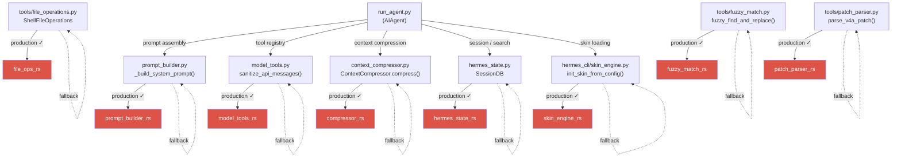

# Hermes Agent - Ferris Fork ☤

A performance oriented Rust fork of [Hermes Agent](https://github.com/NousResearch/hermes-agent) by Nous Research. Maintained by [agent-bob-the-builder](https://github.com/agent-bob-the-builder) at [github.com/agent-bob-the-builder/hermes-agent-ferris-fork](https://github.com/agent-bob-the-builder/hermes-agent-ferris-fork).

---

## What & Why

Eight PyO3 extension crates replace hot-path Python code — no visible behaviour change, but meaningfully faster on every agent turn. All eight are wired into the agent loop with transparent Python fallbacks.

| Crate | Hot path | Status |
|---|---|---|
| `compressor_rs` | `ContextCompressor.compress()` | Production ✓ |
| `model_tools_rs` | Tool registry + message sanitization | Production ✓ |
| `prompt_builder_rs` | System prompt assembly | Production ✓ |
| `skin_engine_rs` | Skin/theme loading and config | Production ✓ |
| `hermes_state_rs` | SQLite SessionDB + FTS5 search | Production ✓ |
| `file_ops_rs` | Binary detection, line numbering, path expansion, shell escaping, unified diff, fuzzy file search | Production ✓ |
| `fuzzy_match_rs` | 8-strategy fuzzy find-and-replace | Production ✓ |
| `patch_parser_rs` | V4A patch format parsing | Production ✓ |

All crates are **transparent fallbacks**: if a crate is missing or fails to load, the Python implementation runs instead with no visible difference.

**Wiring map:**

```
AIAgent (run_agent.py)
├── context_compressor.py
│   └── compressor_rs.compress_async()          [Production ✓]
├── model_tools.py + tools/registry_rs.py
│   └── _model_tools_rust.sanitize()             [Production ✓]
├── hermes_state.py
│   └── _hermes_state_rust session ops            [Production ✓]
├── hermes_cli/skin_engine.py
│   └── _skin_engine_rust + _prompt_builder_rust  [Production ✓]
└── tools/
    ├── file_operations.py (ShellFileOperations)
    │   ├── _is_likely_binary() → _file_ops_rust         [Production ✓]
    │   ├── _add_line_numbers() → _file_ops_rust         [Production ✓]
    │   ├── _native_expand_path() → _file_ops_rust       [Production ✓]
    │   ├── _escape_shell_arg() → _file_ops_rust          [Production ✓]
    │   ├── _unified_diff() → _file_ops_rust              [Production ✓]
    │   ├── _suggest_similar_files() → _file_ops_rust     [Production ✓]
    │   └── _search_native() → _file_ops_rust             [Production ✓]
    ├── fuzzy_match.py
    │   └── fuzzy_find_and_replace() → _fuzzy_match_rs   [Production ✓]
    └── patch_parser.py
        └── parse_v4a_patch() → _patch_parser_rs          [Production ✓]
```



---

## Install

```bash
curl -fsSL https://raw.githubusercontent.com/agent-bob-the-builder/hermes-agent-ferris-fork/main/install.sh | bash
```

---

## Upstream

For everything else — CLI commands, messaging gateway, skills, memory, MCP, cron, etc. — see the [full Hermes Agent documentation](https://hermes-agent.nousresearch.com/docs/).
