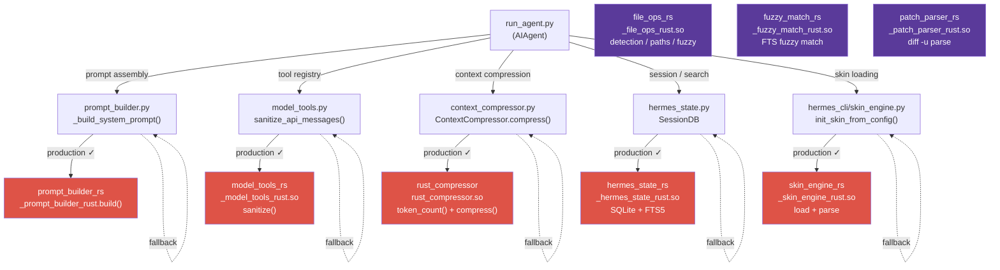

# Hermes Agent - Ferris Fork ☤

A performance oriented Rust fork of [Hermes Agent](https://github.com/NousResearch/hermes-agent) by Nous Research. Maintained by [agent-bob-the-builder](https://github.com/agent-bob-the-builder) at [github.com/agent-bob-the-builder/hermes-agent-ferris-fork](https://github.com/agent-bob-the-builder/hermes-agent-ferris-fork).

---

## What & Why

Eight PyO3 extension crates replace hot-path Python code — no visible behaviour change, but meaningfully faster on every agent turn. The first five are wired into the agent loop; the remaining three handle supporting infrastructure.

| Crate | Hot path | Status |
|---|---|---|
| `rust_compressor` | `ContextCompressor.compress()` | Production ✓ |
| `model_tools_rs` | Tool registry + message sanitization | Production ✓ |
| `prompt_builder_rs` | System prompt assembly | Production ✓ |
| `skin_engine_rs` | Skin/theme loading and config | Production ✓ |
| `hermes_state_rs` | SQLite SessionDB + FTS5 search | Production ✓ |
| `file_ops_rs` | Binary detection, line numbering, path expansion, fuzzy search | Built ✓ |
| `fuzzy_match_rs` | FTS query fuzzy matching with Unicode normalization | Built ✓ |
| `patch_parser_rs` | Patch file parsing (`diff -u` format) | Built ✓ |

All wired crates are **transparent fallbacks**: if a crate is missing or fails to load, the Python implementation runs instead with no visible difference. Built-only crates (`file_ops_rs`, `fuzzy_match_rs`, `patch_parser_rs`) are compiled and available — wiring them into the Python layer is the remaining work.

**Wiring map:**

```
AIAgent (run_agent.py)
├── context_compressor.py
│   └── rust_compressor.compress_async()      [Production ✓]
├── model_tools.py + tools/registry_rs.py
│   └── _model_tools_rust.sanitize()          [Production ✓]
├── hermes_state.py
│   └── _hermes_state_rust session ops        [Production ✓]
└── hermes_cli/skin_engine.py
    └── _skin_engine_rust init_skin_from_config() [Production ✓]
    └── _prompt_builder_rust.build()           [Production ✓]
```



---

## Install

```bash
curl -fsSL https://raw.githubusercontent.com/agent-bob-the-builder/hermes-agent-ferris-fork/main/install.sh | bash
```

---

## Upstream

For everything else — CLI commands, messaging gateway, skills, memory, MCP, cron, etc. — see the [full Hermes Agent documentation](https://hermes-agent.nousresearch.com/docs/).
