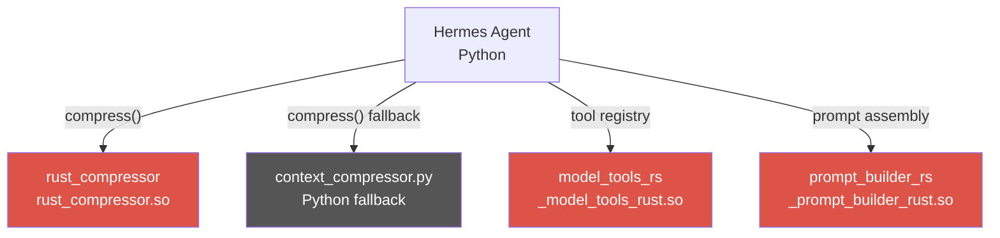

     1|<p align="center">
     2|  
     3|</p>
     4|
     5|# Hermes Agent ☤
     6|
     7|<p align="center">
     8|  <a href="https://hermes-agent.nousresearch.com/docs/"></a>
     9|  <a href="https://discord.gg/NousResearch"></a>
    10|  <a href="https://github.com/NousResearch/hermes-agent/blob/main/LICENSE"></a>
    11|  <a href="https://nousresearch.com"></a>
    12|</p>
    13|
    14|**The self-improving AI agent built by [Nous Research](https://nousresearch.com).** It's the only agent with a built-in learning loop — it creates skills from experience, improves them during use, nudges itself to persist knowledge, searches its own past conversations, and builds a deepening model of who you are across sessions. Run it on a $5 VPS, a GPU cluster, or serverless infrastructure that costs nearly nothing when idle. It's not tied to your laptop — talk to it from Telegram while it works on a cloud VM.
    15|
    16|Use any model you want — [Nous Portal](https://portal.nousresearch.com), [OpenRouter](https://openrouter.ai) (200+ models), [z.ai/GLM](https://z.ai), [Kimi/Moonshot](https://platform.moonshot.ai), [MiniMax](https://www.minimax.io), OpenAI, or your own endpoint. Switch with `hermes model` — no code changes, no lock-in.
    17|
    18|<table>
    19|<tr><td><b>A real terminal interface</b></td><td>Full TUI with multiline editing, slash-command autocomplete, conversation history, interrupt-and-redirect, and streaming tool output.</td></tr>
    20|<tr><td><b>Lives where you do</b></td><td>Telegram, Discord, Slack, WhatsApp, Signal, and CLI — all from a single gateway process. Voice memo transcription, cross-platform conversation continuity.</td></tr>
    21|<tr><td><b>A closed learning loop</b></td><td>Agent-curated memory with periodic nudges. Autonomous skill creation after complex tasks. Skills self-improve during use. FTS5 session search with LLM summarization for cross-session recall. <a href="https://github.com/plastic-labs/honcho">Honcho</a> dialectic user modeling. Compatible with the <a href="https://agentskills.io">agentskills.io</a> open standard.</td></tr>
    22|<tr><td><b>Scheduled automations</b></td><td>Built-in cron scheduler with delivery to any platform. Daily reports, nightly backups, weekly audits — all in natural language, running unattended.</td></tr>
    23|<tr><td><b>Delegates and parallelizes</b></td><td>Spawn isolated subagents for parallel workstreams. Write Python scripts that call tools via RPC, collapsing multi-step pipelines into zero-context-cost turns.</td></tr>
    24|<tr><td><b>Runs anywhere, not just your laptop</b></td><td>Six terminal backends — local, Docker, SSH, Daytona, Singularity, and Modal. Daytona and Modal offer serverless persistence — your agent's environment hibernates when idle and wakes on demand, costing nearly nothing between sessions. Run it on a $5 VPS or a GPU cluster.</td></tr>
    25|<tr><td><b>Research-ready</b></td><td>Batch trajectory generation, Atropos RL environments, trajectory compression for training the next generation of tool-calling models.</td></tr>
    26|</table>
    27|
    28|---
    29|
## Hermes Agent Ferris Fork

A **Rust-accelerated fork** of Hermes Agent that replaces hot-path Python code with
PyO3 extension modules for significantly faster compression, prompt building, and
tool definition lookups. Maintained by syntox (Oliver) at
[github.com/agent-bob-the-builder/hermes-agent-ferris-fork](https://github.com/agent-bob-the-builder/hermes-agent-ferris-fork).

### What was changed and why

The fork introduces three Rust extension crates. Each one targets a specific
hot path that runs on every agent turn:

| Crate | Hot path | Benefit |
|---|---|---|
| `rust-compressor` | `ContextCompressor.compress()` | Faster token counting, summarization, and message pruning on every long-context turn |
| `model_tools_rs` | `model_tools.py` tool registry | Faster tool definition retrieval and sanitization |
| `prompt_builder_rs` | `prompt_builder.py` | Faster prompt assembly |

All three use **PyO3** with the `cdylib` ABI -- loaded as native shared libraries
by the Python runtime. They are **transparent fallbacks**: if a crate is missing or
fails to load, the Python implementation is used instead with no visible behaviour
change to the agent. `rust_compressor` is wired directly into
`ContextCompressor.compress()` with a try/except fast-path; `model_tools_rs` is
imported via `model_tools.py` and its `sanitize_api_messages()` function is called
from `run_agent.py`; `prompt_builder_rs` is available for benchmarking but not yet
called from production code.

**Performance motivation:** Context compression runs on every turn once the
conversation exceeds the threshold. The Rust implementation handles tokenization,
structured summarization, and message pruning without crossing the Python/Rust
FFI boundary repeatedly. Tool sanitization runs on every API message list.

### Architecture



### Install (Ferris Fork)

```bash
# Clone the fork
git clone git@github.com:agent-bob-the-builder/hermes-agent-ferris-fork.git
cd hermes-agent-ferris-fork

# Run the install script -- handles Python deps, Rust toolchain,
# all three PyO3 crates, .env setup, and skills symlink
./install.sh
```

The install script (`./install.sh`) supports three modes:

| Command | What it does |
|---------|-------------|
| `./install.sh` | Full install: Python deps + Rust toolchain + all 3 PyO3 extensions + skills symlink |
| `./install.sh --deps` | Python deps only -- skip Rust build |
| `./install.sh --rust` | Rust build only -- skip Python deps |

After installation, verify all three extensions load:

```bash
python3 -c "import rust_compressor, _model_tools_rust, _prompt_builder_rust; print('All Rust extensions loaded OK')"
```

### Update

```bash
cd hermes-agent-ferris-fork
git pull
./install.sh
```

### Configure

After installation, set your model in `~/.hermes/config.yaml`:

```yaml
model:
  default: MiniMax-M2.7
  provider: minimax
  base_url: https://api.minimax.io/v1
```

Or run the interactive setup:

```bash
python3 cli.py setup
```

---


    30|## Quick Install
    31|
    32|```bash
    33|curl -fsSL https://raw.githubusercontent.com/NousResearch/hermes-agent/main/scripts/install.sh | bash
    34|```
    35|
    36|Works on Linux, macOS, and WSL2. The installer handles everything — Python, Node.js, dependencies, and the `hermes` command. No prerequisites except git.

> **Ferris Fork:** This repo includes the Rust-accelerated Ferris Fork. Run `./install.sh` to build all three PyO3 extensions (compressor, model_tools_rs, prompt_builder_rs) in addition to Python deps. See [## Hermes Agent Ferris Fork](#hermes-agent-ferris-fork) for details.
    37|
    38|> **Windows:** Native Windows is not supported. Please install [WSL2](https://learn.microsoft.com/en-us/windows/wsl/install) and run the command above.
    39|
    40|After installation:
    41|
    42|```bash
    43|source ~/.bashrc    # reload shell (or: source ~/.zshrc)
    44|hermes              # start chatting!
    45|```
    46|
    47|---
    48|
    49|## Getting Started
    50|
    51|```bash
    52|hermes              # Interactive CLI — start a conversation
    53|hermes model        # Choose your LLM provider and model
    54|hermes tools        # Configure which tools are enabled
    55|hermes config set   # Set individual config values
    56|hermes gateway      # Start the messaging gateway (Telegram, Discord, etc.)
    57|hermes setup        # Run the full setup wizard (configures everything at once)
    58|hermes claw migrate # Migrate from OpenClaw (if coming from OpenClaw)
    59|hermes update       # Update to the latest version
    60|hermes doctor       # Diagnose any issues
    61|```
    62|
    63|📖 **[Full documentation →](https://hermes-agent.nousresearch.com/docs/)**
    64|
    65|## CLI vs Messaging Quick Reference
    66|
    67|Hermes has two entry points: start the terminal UI with `hermes`, or run the gateway and talk to it from Telegram, Discord, Slack, WhatsApp, Signal, or Email. Once you're in a conversation, many slash commands are shared across both interfaces.
    68|
    69|| Action | CLI | Messaging platforms |
    70||---------|-----|---------------------|
    71|| Start chatting | `hermes` | Run `hermes gateway setup` + `hermes gateway start`, then send the bot a message |
    72|| Start fresh conversation | `/new` or `/reset` | `/new` or `/reset` |
    73|| Change model | `/model [provider:model]` | `/model [provider:model]` |
    74|| Set a personality | `/personality [name]` | `/personality [name]` |
    75|| Retry or undo the last turn | `/retry`, `/undo` | `/retry`, `/undo` |
    76|| Compress context / check usage | `/compress`, `/usage`, `/insights [--days N]` | `/compress`, `/usage`, `/insights [days]` |
    77|| Browse skills | `/skills` or `/<skill-name>` | `/skills` or `/<skill-name>` |
    78|| Interrupt current work | `Ctrl+C` or send a new message | `/stop` or send a new message |
    79|| Platform-specific status | `/platforms` | `/status`, `/sethome` |
    80|
    81|For the full command lists, see the [CLI guide](https://hermes-agent.nousresearch.com/docs/user-guide/cli) and the [Messaging Gateway guide](https://hermes-agent.nousresearch.com/docs/user-guide/messaging).
    82|
    83|---
    84|
    85|## Documentation
    86|
    87|All documentation lives at **[hermes-agent.nousresearch.com/docs](https://hermes-agent.nousresearch.com/docs/)**:
    88|
    89|| Section | What's Covered |
    90||---------|---------------|
    91|| [Quickstart](https://hermes-agent.nousresearch.com/docs/getting-started/quickstart) | Install → setup → first conversation in 2 minutes |
    92|| [CLI Usage](https://hermes-agent.nousresearch.com/docs/user-guide/cli) | Commands, keybindings, personalities, sessions |
    93|| [Configuration](https://hermes-agent.nousresearch.com/docs/user-guide/configuration) | Config file, providers, models, all options |
    94|| [Messaging Gateway](https://hermes-agent.nousresearch.com/docs/user-guide/messaging) | Telegram, Discord, Slack, WhatsApp, Signal, Home Assistant |
    95|| [Security](https://hermes-agent.nousresearch.com/docs/user-guide/security) | Command approval, DM pairing, container isolation |
    96|| [Tools & Toolsets](https://hermes-agent.nousresearch.com/docs/user-guide/features/tools) | 40+ tools, toolset system, terminal backends |
    97|| [Skills System](https://hermes-agent.nousresearch.com/docs/user-guide/features/skills) | Procedural memory, Skills Hub, creating skills |
    98|| [Memory](https://hermes-agent.nousresearch.com/docs/user-guide/features/memory) | Persistent memory, user profiles, best practices |
    99|| [MCP Integration](https://hermes-agent.nousresearch.com/docs/user-guide/features/mcp) | Connect any MCP server for extended capabilities |
   100|| [Cron Scheduling](https://hermes-agent.nousresearch.com/docs/user-guide/features/cron) | Scheduled tasks with platform delivery |
   101|| [Context Files](https://hermes-agent.nousresearch.com/docs/user-guide/features/context-files) | Project context that shapes every conversation |
   102|| [Architecture](https://hermes-agent.nousresearch.com/docs/developer-guide/architecture) | Project structure, agent loop, key classes |
   103|| [Contributing](https://hermes-agent.nousresearch.com/docs/developer-guide/contributing) | Development setup, PR process, code style |
   104|| [CLI Reference](https://hermes-agent.nousresearch.com/docs/reference/cli-commands) | All commands and flags |
   105|| [Environment Variables](https://hermes-agent.nousresearch.com/docs/reference/environment-variables) | Complete env var reference |
   106|
   107|---
   108|
   109|## Migrating from OpenClaw
   110|
   111|If you're coming from OpenClaw, Hermes can automatically import your settings, memories, skills, and API keys.
   112|
   113|**During first-time setup:** The setup wizard (`hermes setup`) automatically detects `~/.openclaw` and offers to migrate before configuration begins.
   114|
   115|**Anytime after install:**
   116|
   117|```bash
   118|hermes claw migrate              # Interactive migration (full preset)
   119|hermes claw migrate --dry-run    # Preview what would be migrated
   120|hermes claw migrate --preset user-data   # Migrate without secrets
   121|hermes claw migrate --overwrite  # Overwrite existing conflicts
   122|```
   123|
   124|What gets imported:
   125|- **SOUL.md** — persona file
   126|- **Memories** — MEMORY.md and USER.md entries
   127|- **Skills** — user-created skills → `~/.hermes/skills/openclaw-imports/`
   128|- **Command allowlist** — approval patterns
   129|- **Messaging settings** — platform configs, allowed users, working directory
   130|- **API keys** — allowlisted secrets (Telegram, OpenRouter, OpenAI, Anthropic, ElevenLabs)
   131|- **TTS assets** — workspace audio files
   132|- **Workspace instructions** — AGENTS.md (with `--workspace-target`)
   133|
   134|See `hermes claw migrate --help` for all options, or use the `openclaw-migration` skill for an interactive agent-guided migration with dry-run previews.
   135|
   136|---
   137|
   138|## Contributing
   139|
   140|We welcome contributions! See the [Contributing Guide](https://hermes-agent.nousresearch.com/docs/developer-guide/contributing) for development setup, code style, and PR process.
   141|
   142|Quick start for contributors:
   143|
   144|```bash
   145|git clone https://github.com/NousResearch/hermes-agent.git
   146|cd hermes-agent
   147|curl -LsSf https://astral.sh/uv/install.sh | sh
   148|uv venv venv --python 3.11
   149|source venv/bin/activate
   150|uv pip install -e ".[all,dev]"
   151|python -m pytest tests/ -q
   152|```
   153|
   154|> **RL Training (optional):** To work on the RL/Tinker-Atropos integration:
   155|> ```bash
   156|> git submodule update --init tinker-atropos
   157|> uv pip install -e "./tinker-atropos"
   158|> ```
   159|
   160|---
   161|
   162|## Community
   163|
   164|- 💬 [Discord](https://discord.gg/NousResearch)
   165|- 📚 [Skills Hub](https://agentskills.io)
   166|- 🐛 [Issues](https://github.com/NousResearch/hermes-agent/issues)
   167|- 💡 [Discussions](https://github.com/NousResearch/hermes-agent/discussions)
   168|
   169|---
   170|
   171|## License
   172|
   173|MIT — see [LICENSE](LICENSE).
   174|
   175|Built by [Nous Research](https://nousresearch.com).
   176|