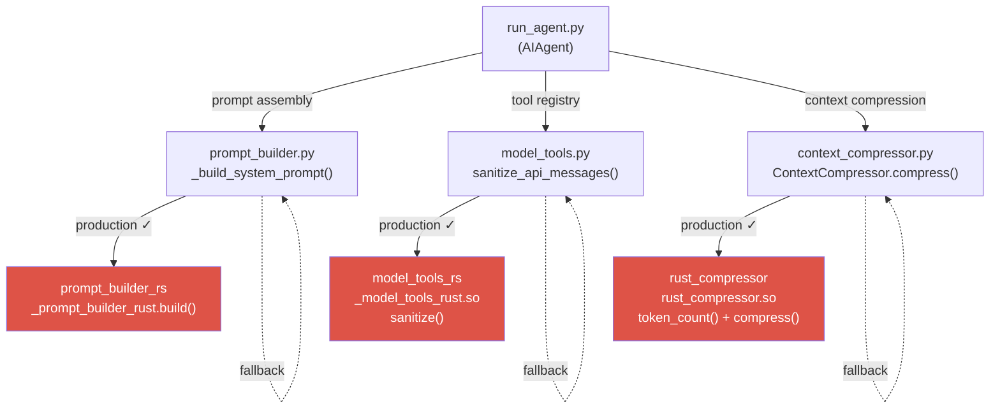

# Hermes Agent Ferris Fork ☤

A **Rust-accelerated fork** of [Hermes Agent](https://github.com/NousResearch/hermes-agent) by Nous Research. Maintained by [syntox](https://github.com/agent-bob-the-builder) at [github.com/agent-bob-the-builder/hermes-agent-ferris-fork](https://github.com/agent-bob-the-builder/hermes-agent-ferris-fork).

---

## What & Why

Three PyO3 extension crates replace hot-path Python code — no visible behaviour change, but meaningfully faster on every agent turn:

| Crate | Hot path | Status |
|---|---|---|
| `rust-compressor` | `ContextCompressor.compress()` | Production ✓ |
| `model_tools_rs` | `model_tools.py` tool registry | Production ✓ |
| `prompt_builder_rs` | `prompt_builder.py` prompt assembly | Production ✓ |

All three are **transparent fallbacks**: if a crate is missing or fails to load, the Python implementation runs instead with no visible difference. `rust_compressor` is wired into `ContextCompressor.compress()`. `model_tools_rs` is imported via `model_tools.py` and its `sanitize_api_messages()` is called from `run_agent.py`. `prompt_builder_rs` is called from `prompt_builder.py`'s `_build_system_prompt()` on every turn.



---

## Install

```bash
curl -fsSL https://raw.githubusercontent.com/agent-bob-the-builder/hermes-agent-ferris-fork/main/install.sh | bash
```

Or clone and run manually:

```bash
git clone git@github.com:agent-bob-the-builder/hermes-agent-ferris-fork.git
cd hermes-agent-ferris-fork
./install.sh
```

`./install.sh` has three modes:

| Command | What it does |
|---|---|
| `./install.sh` | Full install: Python deps + Rust toolchain + all 3 PyO3 extensions + skills symlink |
| `./install.sh --deps` | Python deps only — skip Rust build |
| `./install.sh --rust` | Rust build only — skip Python deps |

Verify all extensions loaded:

```bash
python3 -c "import rust_compressor, _model_tools_rust, _prompt_builder_rust; print('All Rust extensions loaded OK')"
```

Update: `git pull && ./install.sh`

---

## Configure

Set your model in `~/.hermes/config.yaml`:

```yaml
model:
  default: MiniMax-M2.7
  provider: minimax
  base_url: https://api.minimax.io/v1
```

Or run the interactive setup:

```bash
python3 cli.py setup
```

---

## Upstream

For everything else — CLI commands, messaging gateway, skills, memory, MCP, cron, etc. — see the [full Hermes Agent documentation](https://hermes-agent.nousresearch.com/docs/).
